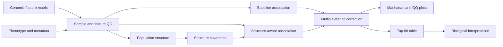

# PanGWASFlow

[](https://github.com/mbilal-OU/PanGWASFlow/actions/workflows/ci.yml)
[](LICENSE)

**Population-structure-aware microbial GWAS across SNPs, accessory genes, k-mers, and unitigs.**

PanGWASFlow is being built as a reproducible Snakemake project for microbial genome-wide association studies. Its central methodological goal is to separate genotype-phenotype evidence from population-structure effects and to keep the statistical assumptions visible.

The first milestone uses a deterministic synthetic teaching benchmark. It validates packaging, configuration, workflow execution, multiple-testing utilities, CI, and result-table conventions before larger analytical modules or biological case studies are added.

## Scientific target

> Which genomic features remain associated with a phenotype after accounting for population structure and multiple testing?

## Planned analysis architecture



## Current v0.1 foundation

Implemented now:

- installable `pangwasflow` Python package
- deterministic binary-feature teaching benchmark
- baseline 2x2 association scan
- Benjamini-Hochberg FDR utility
- machine-readable TSV and JSON outputs
- Snakemake orchestration
- configuration and schema scaffold
- unit tests
- GitHub Actions CI
- citation metadata and scientific guardrails

Next analytical milestone:

- population-structure estimation
- baseline versus structure-adjusted model comparison
- genomic-inflation diagnostics
- Manhattan and QQ plots generated from validated outputs
- modular SNP, accessory-gene, k-mer, and unitig interfaces

## Quick start

```bash
git clone https://github.com/mbilal-OU/PanGWASFlow.git
cd PanGWASFlow

python -m venv .venv
source .venv/bin/activate
pip install -e '.[test]'

snakemake --cores 1
```

Or run the current benchmark directly:

```bash
pangwasflow demo --outdir results/demo --seed 42 --samples 240 --features 120
```

## Current benchmark outputs

```text
results/demo/
├── features.tsv
├── metadata.tsv
├── association_naive.tsv
└── summary.json
```

The benchmark is synthetic and is intended only to validate software behavior and statistical plumbing. It is not presented as a biological result.

## Why structure correction is central

Microbial datasets frequently contain strong clonal or lineage structure. If both a feature and phenotype are lineage-correlated, a naive association can look convincing even when the feature is not the direct driver. PanGWASFlow will therefore preserve baseline and structure-adjusted results side by side rather than hiding the comparison.

## Planned genomic representations

1. core-genome SNPs
2. accessory-gene presence/absence
3. k-mers
4. unitigs

These representations will remain separate through association testing and will be compared only at the interpretation layer.

## Scientific guardrails

Association is statistical evidence, not proof of causation. Population structure, phenotype quality, multiple testing, feature frequency, linkage, and model assumptions must be reported explicitly. See [`docs/scientific_guardrails.md`](docs/scientific_guardrails.md).

## Repository layout

```text
PanGWASFlow/
├── config/
├── docs/
├── examples/
├── src/pangwasflow/
├── tests/
├── workflow/
├── Snakefile
├── environment.yaml
└── pyproject.toml
```

## Status

`v0.1` foundation is under active validation. README result figures will only be added after they can be generated reproducibly from validated output tables.

## Citation

Citation metadata is provided in [`CITATION.cff`](CITATION.cff).

## License

MIT License. See [`LICENSE`](LICENSE).
