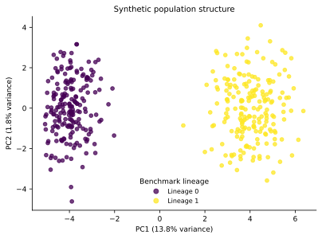
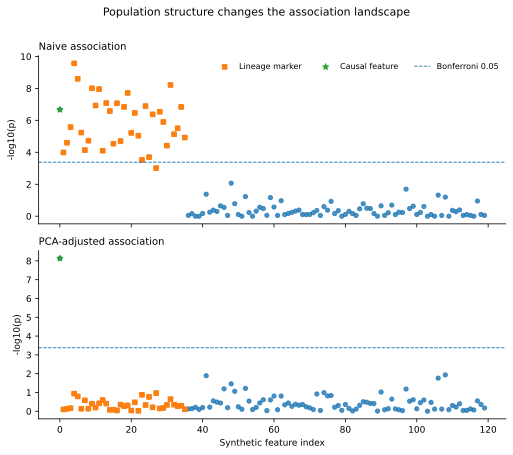
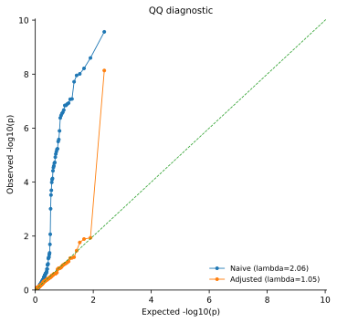
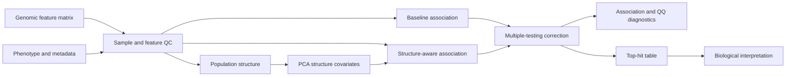

# PanGWASFlow

[](https://github.com/mbilal-OU/PanGWASFlow/actions/workflows/ci.yml)
[](LICENSE)

**Population-structure-aware microbial GWAS across SNPs, accessory genes, k-mers, and unitigs.**

PanGWASFlow is a reproducible Snakemake project for microbial genome-wide association studies. Its central methodological goal is to separate genotype-phenotype evidence from population-structure effects while keeping model assumptions and diagnostics visible.

## Scientific question

> Which genomic features remain associated with a phenotype after accounting for population structure and multiple testing?

## Structure-correction validation

The current benchmark is a deterministic synthetic stress test with **400 samples and 120 binary genomic features**. It contains one true phenotype-associated feature, 35 lineage-correlated neutral features, and 84 null features. The latent lineage label is retained only to validate the benchmark; the adjusted association model receives PCA-derived covariates, not the true lineage label.

### Population structure recovered from the feature matrix



PC1 captures the designed lineage structure. The first two PCs explain **13.8%** and **1.8%** of feature-matrix variance, respectively.

### Naive versus structure-adjusted association



The deliberately confounded benchmark produces a clear contrast:

| Diagnostic | Naive scan | PCA-adjusted scan |
| --- | ---: | ---: |
| Genomic-inflation lambda | **2.06** | **1.05** |
| Significant lineage markers at BH q < 0.05 | **35 / 35** | **0 / 35** |
| Causal feature | retained | retained |
| Causal-feature q value | 1.97 × 10^-6 | 8.80 × 10^-7 |

The key result is not that PCA makes associations disappear. It is that the known lineage-driven false positives collapse while the deliberately causal feature remains strongly associated.

### QQ diagnostic



The naive scan shows strong departure from the null expectation because lineage structure induces many correlated associations. After adjustment, lambda returns close to 1.0 and the systematic inflation is removed.

All numbers and figures above are generated from the committed validation outputs in [`examples/synthetic/results_preview`](examples/synthetic/results_preview/). The figures are reproducible SVGs generated by the package, not manually drawn illustrations.

## Analysis architecture



## Implemented now

- installable `pangwasflow` Python package and CLI
- deterministic population-structure stress test
- standardized PCA-derived structure covariates
- baseline Fisher exact association scan
- structure-adjusted logistic regression scan
- Benjamini-Hochberg FDR correction
- genomic-inflation diagnostic
- PCA, association-comparison, and QQ SVG figures
- strict 0/1 phenotype metadata ingestion
- sample-by-feature binary matrix input for precomputed SNPs, k-mers, unitigs, or other binary genomic features
- Roary/Panaroo-style `gene_presence_absence.csv` conversion to accessory-gene matrices
- explicit sample intersection and dropped-sample reporting
- feature-prevalence QC with an auditable retained/dropped table
- generic prepared-input GWAS runner
- machine-readable TSV and JSON outputs
- Snakemake orchestration
- unit tests that explicitly test confounding removal and input validation
- GitHub Actions CI
- automated regeneration of validated README assets
- citation metadata and scientific guardrails

## Quick start

```bash
git clone https://github.com/mbilal-OU/PanGWASFlow.git
cd PanGWASFlow

python -m venv .venv
source .venv/bin/activate
pip install -e '.[test]'

snakemake --cores 1
```

Run the validated teaching benchmark:

```bash
pangwasflow demo \
  --outdir results/demo \
  --seed 42 \
  --samples 400 \
  --features 120 \
  --pcs 2
```

Prepare a real precomputed binary SNP matrix:

```bash
pangwasflow prepare \
  --features core_snp_matrix.tsv \
  --metadata phenotype.tsv \
  --format matrix \
  --outdir results/prepared

pangwasflow analyze \
  --features results/prepared/features_qc.tsv \
  --metadata results/prepared/metadata_qc.tsv \
  --pcs 2 \
  --outdir results/gwas
```

For a Roary/Panaroo accessory-gene table, use `--format roary` or `--format panaroo`. Full input specifications and QC behavior are documented in [`docs/input_formats.md`](docs/input_formats.md).

## Real-input preparation outputs

```text
results/prepared/
├── features_qc.tsv
├── metadata_qc.tsv
├── feature_qc.tsv
├── sample_alignment.json
└── input_summary.json
```

The current real-input layer intentionally expects upstream genomic feature construction. PanGWASFlow does not silently reinterpret missing genotypes as absence and does not infer phenotype meanings from free-text labels.

## Benchmark outputs

```text
results/demo/
├── features.tsv
├── metadata.tsv
├── feature_truth.tsv
├── pca_scores.tsv
├── association_naive.tsv
├── association_adjusted.tsv
├── summary.json
└── figures/
    ├── pca_structure.svg
    ├── association_comparison.svg
    └── qq_comparison.svg
```

The benchmark is synthetic and is intended only to validate statistical behavior, reproducibility, and software integration. It is not presented as a biological result.

## Why structure correction is central

Microbial populations are often strongly clonal or lineage-structured. If both a genomic feature and a phenotype are lineage-correlated, an unadjusted test can identify the feature even when it is not the direct driver of the phenotype. PanGWASFlow therefore preserves baseline and structure-adjusted results side by side and reports diagnostic evidence rather than hiding the effect of correction.

## Next analytical modules

1. richer SNP metadata and genomic-coordinate handling
2. k-mer-specific interface
3. unitig-specific interface
4. real public microbial phenotype case study
5. significant-locus annotation and genomic context
6. integrated HTML report and interactive locus explorer

The genomic representations will remain separate through association testing and will be compared at the interpretation layer rather than treated as interchangeable feature types.

## Scientific guardrails

Association is statistical evidence, not proof of causation. Population structure, phenotype quality, multiple testing, feature frequency, linkage, and model assumptions must be reported explicitly. See [`docs/scientific_guardrails.md`](docs/scientific_guardrails.md), [`docs/structure_benchmark.md`](docs/structure_benchmark.md), and [`docs/input_formats.md`](docs/input_formats.md).

## Repository layout

```text
PanGWASFlow/
├── config/
├── docs/
│   └── assets/
├── examples/
│   └── synthetic/
├── src/pangwasflow/
├── tests/
├── workflow/
├── Snakefile
├── environment.yaml
└── pyproject.toml
```

## Citation

Citation metadata is provided in [`CITATION.cff`](CITATION.cff).

## License

MIT License. See [`LICENSE`](LICENSE).
