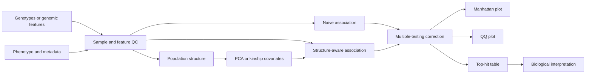

# PanGWASFlow

[](https://github.com/mbilal-OU/PanGWASFlow/actions/workflows/ci.yml)
[](LICENSE)

**Population-structure-aware microbial GWAS across SNPs, accessory genes, k-mers, and unitigs.**

PanGWASFlow is a reproducible Snakemake project for microbial genome-wide association studies. Its central methodological goal is to make one problem impossible to ignore: in clonally structured populations, a strong association can reflect lineage structure rather than a causal genotype-phenotype relationship.

The first validated milestone uses a synthetic demonstration dataset so that the expected causal and confounded signals are known in advance. Larger biological case studies will be added only after the statistical workflow is validated.

## Core question

> Which genomic features are associated with a phenotype after accounting for population structure and multiple testing?

## Workflow



## What the first release demonstrates

- deterministic synthetic genotype and phenotype generation
- a deliberately confounded lineage effect
- genotype QC and phenotype checks
- PCA-based population-structure covariates
- naive per-feature logistic association
- population-structure-adjusted logistic association
- odds ratios, standard errors, P values, and Benjamini-Hochberg FDR
- genomic inflation diagnostics
- Manhattan-style and QQ plots
- machine-readable result tables
- Snakemake orchestration
- unit tests and GitHub Actions CI

The synthetic demo is designed so that one true causal feature and one lineage-correlated non-causal feature can be tracked separately. The expected behavior is that structure adjustment reduces the apparent evidence for the confounded feature while preserving evidence for the true causal feature.

## Quick start

```bash
git clone https://github.com/mbilal-OU/PanGWASFlow.git
cd PanGWASFlow

python -m venv .venv
source .venv/bin/activate
pip install -e '.[test]'

snakemake --cores 1
```

The default workflow writes the synthetic demonstration to `results/demo/`.

You can also run the demonstration directly:

```bash
pangwasflow demo --outdir results/demo --seed 42 --samples 240 --features 120
```

## Expected outputs

```text
results/demo/
├── metadata.tsv
├── genotypes.tsv
├── pcs.tsv
├── association_naive.tsv
├── association_adjusted.tsv
├── top_hits.tsv
├── summary.json
├── manhattan_naive.svg
├── manhattan_adjusted.svg
├── qq_naive.svg
└── qq_adjusted.svg
```

## Planned biological layers

The architecture is intentionally representation-agnostic. Later modules will accept:

1. core-genome SNPs
2. accessory-gene presence/absence
3. k-mers
4. unitigs

Those layers will be compared rather than collapsed into a single result table. A hit that appears across multiple genomic representations is biologically different from a lineage-specific signal seen in only one representation.

## Scientific guardrails

PanGWASFlow treats association as statistical evidence, not proof of causation. Population structure, phenotype quality, linkage, lineage effects, multiple testing, feature frequency, and model assumptions are reported explicitly. See [`docs/scientific_guardrails.md`](docs/scientific_guardrails.md).

## Repository layout

```text
PanGWASFlow/
├── config/
├── docs/
├── examples/
├── src/pangwasflow/
├── tests/
├── workflow/
├── Snakefile
├── environment.yaml
└── pyproject.toml
```

## Development status

`v0.1` foundation in active development. The current branch focuses on a statistically testable synthetic benchmark before public biological case studies are introduced.

## Citation

Citation metadata is provided in [`CITATION.cff`](CITATION.cff).

## License

MIT License. See [`LICENSE`](LICENSE).
