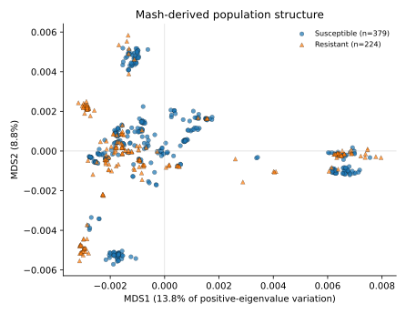
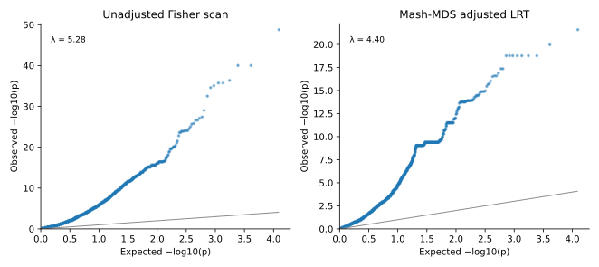
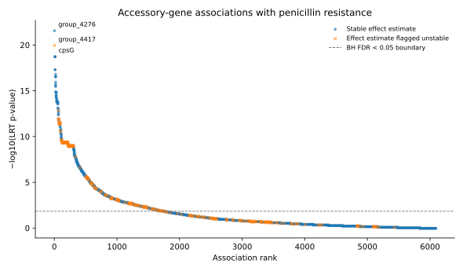

# Pneumococcal penicillin-resistance case study

This case study is PanGWASFlow's first published-data validation beyond synthetic benchmarks.

## Dataset

The source dataset is the public pyseer tutorial collection for penicillin resistance in *Streptococcus pneumoniae*:

- Figshare DOI: `10.6084/m9.figshare.7588832`
- Figshare article ID: `7588832`
- Figshare version resolved by CI: `10.6084/m9.figshare.7588832.v1`
- License: CC BY 4.0
- Published archive: `pyseer_tutorial.tar.bz2`
- Archive size: 395,485,754 bytes
- Published MD5: `d7d5db5f931d7d8233199d416355f2d1`
- Genomes represented in the accessory-gene matrix: 616
- Phenotyped isolates: 603
- Resistant isolates: 224
- Susceptible isolates: 379
- Accessory-gene families in the Rtab input: 10,944
- Accessory-gene families retained after 1% to 99% prevalence filtering: 6,087

PanGWASFlow does not vendor the source dataset. GitHub Actions resolves the Figshare record, verifies the published archive checksum and size, and extracts only the phenotype, accessory-gene matrix, and published Mash sketch required for this validation path.

## Scientific scope

The case-study layer evaluates accessory-gene association with binary penicillin resistance. It is a reproducibility and software-validation example, not a claim of a new resistance mechanism.

The archive contains `mash_sketch.msh`, the published Mash sketch used by the reference tutorial. CI reconstructs the all-vs-all Mash distance matrix from that sketch, validates all 616 sample identifiers, and estimates population structure by classical multidimensional scaling. Eight MDS components are included as fixed-effect covariates, matching the structure dimensionality used in the reference pyseer tutorial.

Adjusted significance is evaluated by a logistic-regression likelihood-ratio test comparing each feature model with one shared structure-only null model. Wald statistics are retained as secondary effect-estimate diagnostics only. Model convergence and effect stability are reported separately so that complete or near-complete separation does not produce a misleadingly precise biological interpretation.

The published pyseer tutorial also reports that its SNP analysis recovers the established penicillin-binding-protein loci `pbp2x`, `pbp1a`, and `pbp2b`. Those remain positive controls for a later SNP-coordinate validation layer.

## Validated results

The full published-data workflow is executed in GitHub Actions from the checksum-verified Figshare archive. The audited run retained exactly **6,087 accessory-gene families** across **603 phenotyped isolates**.

### Mash-derived population structure

The eight positive classical-MDS dimensions are derived from the 603-isolate subset of the reconstructed Mash distance matrix. The first eight dimensions account for approximately 56.7% of the positive MDS eigenvalue mass used by PanGWASFlow.

### Calibration before and after structure adjustment

Genomic-inflation lambda decreases from **5.278** in the naive Fisher scan to **4.404** after Mash-MDS adjustment. The direction of change shows that independent genomic-distance covariates remove part of the confounding signal. The adjusted lambda remains high, however, so this case study does not claim complete calibration. Strongly linked accessory-gene distributions, lineage structure, and non-independent tests remain visible features of the dataset.

### Ranked accessory-gene associations

The strongest stable adjusted signal is `group_4276` with LRT **p = 2.53 × 10^-22**. The identically distributed `cpsG`, `mnaA`, `tagA`, `group_3096`, `group_5738`, `group_8161`, and `group_8834` features each yield LRT **p = 1.69 × 10^-19**. These repeated values are expected for features with identical presence-absence patterns.

`group_4417` also produces a very small LRT p value, but its fitted coefficient is extreme and its standard error degenerates under separation. PanGWASFlow therefore keeps the association test in the output while marking the effect estimate as unstable. That distinction is deliberate: association evidence and a reliable odds-ratio estimate are not the same thing.

The real-data results are committed in [`results_preview`](results_preview/) as:

- `input_summary.json`
- `gwas_summary.json`
- `top30_adjusted.tsv`

These files and the three vector figures above are regenerated from the audited CI output rather than manually edited.

## PanGWASFlow validation stages

1. Resolve and verify the public Figshare record.
2. Verify archive size and MD5 before analysis.
3. Extract `resistances.pheno`, `gene_presence_absence.Rtab`, and `mash_sketch.msh` only.
4. Reconstruct the 616-by-616 Mash distance matrix from the published sketch.
5. Normalize archived assembly identifiers and validate them against phenotype and Rtab sample identifiers.
6. Align the 603 phenotyped isolates to the 616-genome feature and distance inputs.
7. Preserve Rtab missing-value semantics and apply explicit feature QC.
8. Retain features between 1% and 99% prevalence.
9. Compute eight classical-MDS population-structure covariates from Mash distances.
10. Run an unadjusted Fisher scan and structure-adjusted logistic LRT scan.
11. Report Benjamini-Hochberg q values, genomic inflation, convergence status, and effect-stability diagnostics.
12. Generate the results preview and figures directly from the audited workflow outputs.

## Interpretation guardrails

Accessory-gene hits are association signals, not proof of causality. The residual inflation in this dataset is substantial and must not be hidden. Closely linked or identically distributed gene families can produce the same association statistic, and a significant LRT does not guarantee that the corresponding odds-ratio estimate is stable. Lineage effects, phenotype quality, annotation context, genomic linkage, and validation in independent data remain necessary before making mechanistic claims.

The numerical agreement of key accessory-gene signals with the reference tutorial is used here as software validation. PanGWASFlow is not presenting these genes as newly discovered determinants of penicillin resistance.

## References

- Lees JA et al. Sequence element enrichment analysis to determine the genetic basis of bacterial phenotypes. *Nature Communications* (2016). DOI: `10.1038/ncomms12797`.
- Lees JA et al. pyseer: a comprehensive tool for microbial pangenome-wide association studies. *Bioinformatics* (2018). DOI: `10.1093/bioinformatics/bty539`.
- Pyseer GWAS tutorial: `https://pyseer.readthedocs.io/en/master/tutorial.html`.
